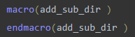
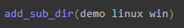
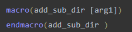
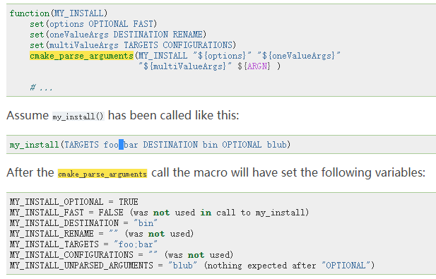

# 宏-根据操作系统类型添加子目录.md

&emsp;&emsp;现在我们有一个需求，在编译项目时要求在Windows下添加库DemoWin的源源码进入工程，在Linux下要求添加库DemoLinux的源码进入工程。但是从现有的cmake命令来看，是没有这项功能的。我们现在实现一个`add_sub_dir()`函数来完成这个功能。

## 需求分析

1. 实现这个功能，我们可以有两种方法，第一种是编写一个宏，第二种是编写函数，两种实现方式大同小异看，本章，我们用宏来实现

2. 要实现功能，该宏应该接受几个参数，第一应该指定操作系统类型，第二应该指定要添加的目录，所以这个宏的用法就想这样 `add_sub_dir(Linux DemoWin)`

   
  

`&emsp;&emsp;下面我们开始动手搞定这件事情`

## 准备工作

1. 我们需要掌握cmake宏的写法下面请看官方语法介绍
```cmake
macro(<name> [arg1 [arg2 [arg3 ...]]])
  COMMAND1(ARGS ...)
  COMMAND2(ARGS ...)
endmacro(<name>)
```
定义完成后，我们可以通过cmake内置的变量来访问宏的参数，这些变量的说明如下：
| 变量名 | 说明                                                 |
| ------ | ---------------------------------------------------- |
| argv#  | #是一个下标，0指向第一个参数，累加                   |
| argv   | 所有的参数                                           |
| argn   | 定义参数以为的参数                                   |
| argc   | 传入的实际参数的个数，也就是调用函数是传入的参数个数 |

*释一下`argv`个`argn`*

| 定义时                                                      | 调用时                                                      | argn           | argv           |
| ----------------------------------------------------------- | ----------------------------------------------------------- | -------------- | -------------- |
|  |  | demo linux win | demo linux win |
|  |  | linux win      | demo linux win |


2. 我们需要掌握cmake的参数解析函数`cmake_parse_arguments`

   [语法如下](https://cmake.org/cmake/help/v3.9/command/cmake_parse_arguments.html?highlight=cmake_parse_arguments)

   ```cmake
   cmake_parse_arguments(<prefix> <options> <one_value_keywords>
                         <multi_value_keywords> args...)
   ```

   下面是官方给出的例子

   

3. 下面我们来动手实现这个功能


message(":" ${CMAKE_SYSTEM_NAME})
message(":" ${CMAKE_HOST_SYSTEM_NAME})
message(":" ${CMAKE_SYSTEM_VERSION})


根据系统环境选择子目录是否加入工程进行编译