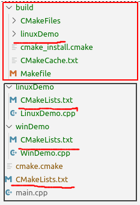

# 宏-根据操作系统类型添加子目录

&emsp;&emsp;现在我们有一个需求，在编译项目时要求在Windows下添加库DemoWin的源源码进入工程，在Linux下要求添加库DemoLinux的源码进入工程。但是从现有的cmake命令来看，是没有这项功能的。我们现在实现一个`add_sub_dir()`函数来完成这个功能。

## 需求分析

1. 实现这个功能，我们可以有两种方法，第一种是编写一个宏，第二种是编写函数，两种实现方式大同小异看，本章，我们用宏来实现

2. 要实现功能，该宏应该接受几个参数，第一应该指定操作系统类型，第二应该指定要添加的目录，所以这个宏的用法就像这样 `add_sub_dir(Linux DemoWin)`

3. 我们还需要知道当前操作系统的类型，cmake为我们提供了一下内置变量供我们使用，他们如下

   ```cmake
   CMAKE_SYSTEM_VERSION
   CMAKE_SYSTEM_NAME
   CMAKE_HOST_SYSTEM_NAME
   ```

> CMAKE_SYSTEM_NAME

> The name of the operating system for which CMake is to build. See the [`CMAKE_SYSTEM_VERSION`](https://cmake.org/cmake/help/v3.5/variable/CMAKE_SYSTEM_VERSION.html#variable:CMAKE_SYSTEM_VERSION) variable for the OS version.

> System Name for Host Builds

> `CMAKE_SYSTEM_NAME` is by default set to the same value as the [`CMAKE_HOST_SYSTEM_NAME`](https://cmake.org/cmake/help/v3.5/variable/CMAKE_HOST_SYSTEM_NAME.html#variable:CMAKE_HOST_SYSTEM_NAME) variable so that the build targets the host system.

> System Name for Cross Compiling

>`CMAKE_SYSTEM_NAME` may be set explicitly when first configuring a new build tree in order to enable [cross compiling](https://cmake.org/cmake/help/v3.5/manual/cmake-toolchains.7.html#cross-compiling-toolchain). In this case the [`CMAKE_SYSTEM_VERSION`](https://cmake.org/cmake/help/v3.5/variable/CMAKE_SYSTEM_VERSION.html#variable:CMAKE_SYSTEM_VERSION) variable must also be set explicitly.

[摘自cmake文档](https://cmake.org/cmake/help/v3.5/variable/CMAKE_SYSTEM_NAME.html?highlight=cmake_system_name)

&emsp;&emsp;下面我们开始动手搞定这件事情`

## 准备工作

1. 我们需要掌握cmake宏的写法下面请看官方语法介绍
```cmake
macro(<name> [arg1 [arg2 [arg3 ...]]])
  COMMAND1(ARGS ...)
  COMMAND2(ARGS ...)
endmacro(<name>)
```
定义完成后，我们可以通过cmake内置的变量来访问宏的参数，这些变量的说明如下：
| 变量名 | 说明                                                 |
| ------ | ---------------------------------------------------- |
| argv#  | #是一个下标，0指向第一个参数，累加                   |
| argv   | 所有的参数                                           |
| argn   | 定义参数以为的参数                                   |
| argc   | 传入的实际参数的个数，也就是调用函数是传入的参数个数 |

*释一下`argv`个`argn`*

| 定义时                                                      | 调用时                                                      | argn           | argv           |
| ----------------------------------------------------------- | ----------------------------------------------------------- | -------------- | -------------- |
|  |  | demo linux win | demo linux win |
|  |  | linux win      | demo linux win |


2. 我们需要掌握cmake的参数解析函数`cmake_parse_arguments`

   [语法如下](https://cmake.org/cmake/help/v3.9/command/cmake_parse_arguments.html?highlight=cmake_parse_arguments)

   ```cmake
   cmake_parse_arguments(<prefix> <options> <one_value_keywords>
                         <multi_value_keywords> args...)
   ```

   下面是官方给出的例子

   

3. 下面我们来动手实现这个功能

   现在我们先分析一下逻辑

   * 获取当前操作系统类型

   * 解析参数，看当前系统是否需要添加子目录

   * 将子目录的CMakeLists.txt添加到工程中

   代码如下
   
   ```cmake
   if("!${CMAKE_SYSTEM_NAME}" STREQUAL "!Windows")
       set(OS_WIN TRUE)
   elseif("!${CMAKE_SYSTEM_NAME}" STREQUAL "!Linux")
       set(OS_LINUX TRUE)
   elseif("!${CMAKE_SYSTEM_NAME}" STREQUAL "!Darwin")
       set(OS_MAC TRUE)
   else()
       message(FATAL_ERROR "Unknown platform: ${CMAKE_SYSTEM_NAME}!")
   endif()
   
   
   macro(add_sub_dir)
       set(os Linux win mac)
       cmake_parse_arguments(tmp "${os}" "" "" ${ARGN})
       
       #如果没有传入参数，所有系统都添加
       if(NOT tmp_Linux AND NOT tmp_win AND NOT tmp_mac)
           set(tmp_Linux ON)
           set(tmp_win ON)
           set(tmp_mac ON)
       endif()
       if(tmp_Linux)
           set(tmp_Linux ON)
       endif()
       if(tmp_win)
           set(tmp_win ON)
       endif()
       if(tmp_mac)
         set(tmp_mac ON)
       endif()
   
       set(isAdd OFF)
       if(OS_WIN)
           set(isAdd ${tmp_win})
       elseif(OS_LINUX)
           set(isAdd ${tmp_Linux})
       elseif(OS_MAC)
           set(isAdd ${tmp_mac})
       endif()
   
       if(isAdd)
   		set(dir ${tmp_UNPARSED_ARGUMENTS})
   		if(EXISTS "${CMAKE_CURRENT_SOURCE_DIR}/${dir}")
   			if(EXISTS "${CMAKE_CURRENT_SOURCE_DIR}/${dir}/CMakeLists.txt")
   				add_subdirectory(${dir})
   			endif()
   		else()
   			message(WARNING "${dir} does not exists")
   		endif()
   	endif()
   endmacro(add_sub_dir)
	```




可以看到，在Linux平台下编译，只有linuxDemo参与了