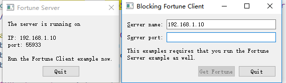
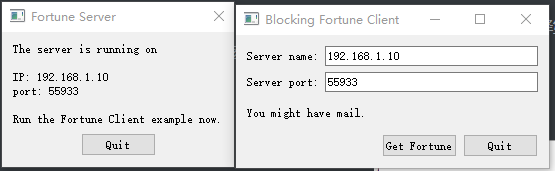
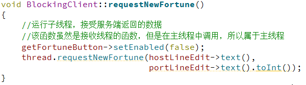
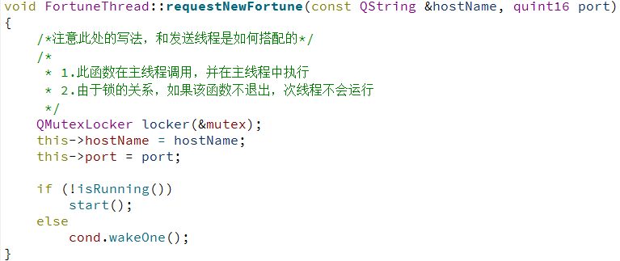
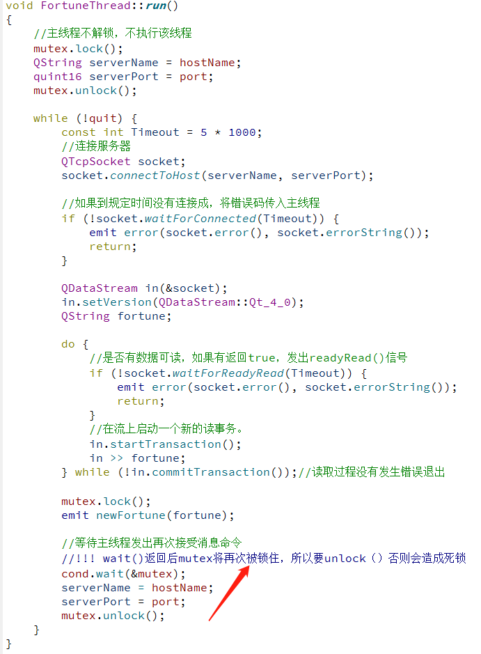
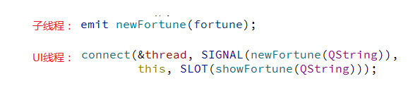

# BlockingFortuneClient

## 示例功能

&emsp;&emsp;程序运行后，枚举当前系统所有ip，选择第一个IPV4地址作为要连接的TCP服务器地址，当输入端口号后，从服务器获取一段信息。

1. 初始化时

2. 连接服务器后

## 代码解析

&emsp;&emsp;忽略程序初始化代码

1. 点解`Get Fortune`按钮，运行接收数据线程
2. 根据接收线程状态，执行接收线程
3. 接收主线程传入的数据，并通过信号将数据传入主线程

## 小知识点

1. 子线程不能修改UI界面，所以必须将数据传入UI线程，让UI线程处理。在QT中一种简单的方法是信号和槽

## 参考

[QWaitCondition 的正确使用方法](https://blog.csdn.net/flyoxs/article/details/54617342)