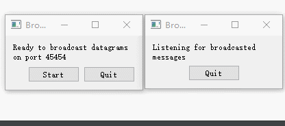
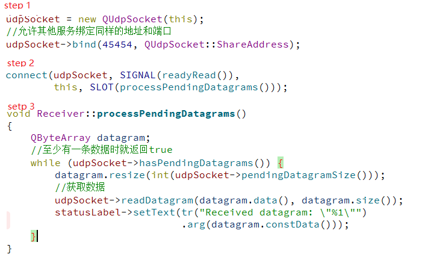
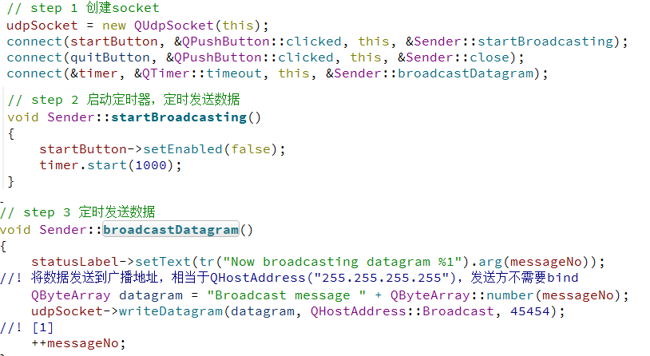

# 使用UDP进行广播

本文讲述qt示例中udp的使用方法，完整示请参考qt官方示例，下图为示例运行图

由于实例中UDP的使用较为简单，所以将发送和接收总结在一起

## BroadcastReceiver

### 示例功能

创建UDP连接，监听本地`45454`端口，定有广播数据时接收并显示在QLabel上。

### 代码分析

本示例的代码比较简单，创建一个UDP连接，当有数据可以读取时，QUdpSocket会发射readyRead()信号，此时可以调用槽函数来接收数据。完整代码见下图

## BroadcastSender

### 示例功能

创建UDP连接，将数据广播出去。只要接收端监听45454端口即可收到数据

代码片段如下

