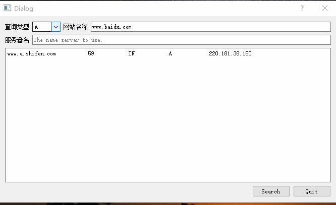
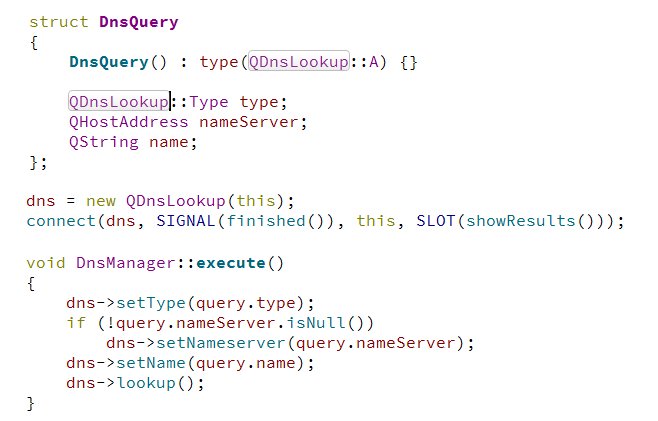

# 域名查询系统

## 什么是域名

> &emsp;&emsp;在 Internet 上有千百万台主机，为了区分这些主机，每一台主机都被分配一个 IP 地址。但由于 IP 地址没有实际意义且难于记忆，于是就有了域名（Domain Name）。
> &emsp;&emsp;域名主要是由英文字母、阿拉伯数字、“ - ” 、“ . ” 等组成，目的是为了方便记忆和沟通一组服务器的地址（网站、电子邮件、FTP 等）。
> &emsp;&emsp;域名和 IP 是相互对应的，在 Internet 上专门有 DNS（域名服务器）来进行域名与 IP 的相互转换，您在浏览器上输入域名， DNS 会进行域名与 IP 的转换，才能找到相应的服务器，打开相应的网页。

## 示例的功能

&emsp;&emsp;根据输入的域名查询IP，由于源代码是使用命令行运行的，有点不方便，所以稍微修改了一下，下面是效果图



## 代码分析

### 本利中使用到的类有

&emsp;&emsp;`QDNSLookup`类可以查询的信息有如下几种,

| Constant          | Value | Description                                               |
| ----------------- | ----- | --------------------------------------------------------- |
| QDnsLookup::A     | 1     | IPv4地址记录                                              |
| QDnsLookup::AAAA  | 28    | IPv6 地址记录                                             |
| QDnsLookup::ANY   | 255   | 任何记录                                                  |
| QDnsLookup::CNAME | 5     | 别名记录(该记录值为另一个域名)                            |
| QDnsLookup::MX    | 15    | 邮件交换记录                                              |
| QDnsLookup::NS    | 2     | 域名服务器记录，用来指定该域名由哪个DNS服务器来进行解析。 |
| QDnsLookup::PTR   | 12    | PTR记录，是电子邮件系统中的邮件交换记录的一种；           |
| QDnsLookup::SRV   | 33    | 记录了哪台计算机提供了哪个服务                            |
| QDnsLookup::TXT   | 16    | TXT记录,一般指为某个主机名或域名设置的说明,               |

1. QDnsDomainNameRecord

    存储关于域名记录的信息，在执行名称服务器查找时，将返回零条或多条记录。

   ```c++
     // CNAME records
       foreach (const QDnsDomainNameRecord &record, dns->canonicalNameRecords())
           ret = QString("%1\t%2\tIN\tCNAME\t%3\n")
                   .arg(record.name())
                   .arg(record.timeToLive())
                   .arg(record.value());
   
    // NS records
       foreach (const QDnsDomainNameRecord &record, dns->nameServerRecords())
           ret = QString("%1\t%2\tIN\tNS\t%3\n")
                   .arg(record.name())
                   .arg(record.timeToLive())
                   .arg(record.value());
    // PTR records
       foreach (const QDnsDomainNameRecord &record, dns->pointerRecords())
           ret = QString("%1\t%2\tIN\tPTR\t%3\n")
                   .arg(record.name())
                   .arg(record.timeToLive())
                   .arg(record.value());
   ```
   
   
   
   |     函数     |                 作用                 |
   | :----------: | :----------------------------------: |
   |    name()    |           返回此记录的名称           |
   | timeToLive() | 返回此记录有效的持续时间(以秒为单位) |
   |   value()    |          返回此域名记录的值          |


2. QDnsHostAddressRecord

   类存储有关主机地址记录的信息，执行地址查找时，将返回零条或多条记录。

   ```c++
      // A and AAAA records
       foreach (const QDnsHostAddressRecord &record, dns->hostAddressRecords()) {
           const char *type = (record.value().protocol() == QAbstractSocket::IPv6Protocol) ? "AAAA" : "A";
           ret = QString("%1\t%2\tIN\t%3\t%4\n")
                   .arg(record.name())
                   .arg(record.timeToLive())
                   .arg(type)
                   .arg(record.value().toString());
       }
   ```
   
   
   
   |     函数     |                 作用                 |
   | :----------: | :----------------------------------: |
   |    name()    |           返回此记录的名称           |
   | timeToLive() | 返回此记录有效的持续时间(以秒为单位) |
   |   value()    |        返回此主机地址记录的值        |


3. QDnsServiceRecord

   类存储关于DNS SRV记录的信息。在对服务执行查找时，将返回零条或多条记录

   ```c++
   // SRV records
       foreach (const QDnsServiceRecord &record, dns->serviceRecords())
         	 ret = QString("%1\t%2\tIN\tSRV\t%3 %4 %5 %6\n")
                  .arg(record.name())
                  .arg(record.timeToLive())
                  .arg(record.priority())
                  .arg(record.weight())
                  .arg(record.port())
                  .arg((record.target()));
   ```

   |     函数     |                             作用                             |
   | :----------: | :----------------------------------------------------------: |
   |    name()    |                       返回此记录的名称                       |
   |    port()    |               返回此服务记录在目标主机上的端口               |
   |  priority()  | 返回此服务记录的优先级。客户端必须尝试以编号最低的优先级与目标主机联系 |
   |   target()   |               返回此服务记录的目标主机的域名。               |
   | timeToLive() |            返回此记录有效的持续时间(以秒为单位)。            |
   |   weight()   | 返回此服务记录的权重。weight字段为具有相同优先级的条目指定一个相对权重。具有较高权重的条目应该选择具有较高概率的条目 |

   

4. QDnsMailExchangeRecord

   类存储关于DNS MX记录的信息,在对服务执行查找时，将返回零条或多条记录

   ```c++
    // MX records
       foreach (const QDnsMailExchangeRecord &record, dns->mailExchangeRecords())
             ret = QString("%1\t%2\tIN\tMX\t%3 %4\n")
                   .arg(record.name())
                   .arg(record.timeToLive())
                   .arg(record.preference())
                   .arg(record.exchange());
   ```

   

   |    函数    |                  作用                  |
   | :--------: | :------------------------------------: |
   |  exchange  |      返回此记录的邮件交换的域名。      |
   |    name    |           返回此记录的名称。           |
   | preference |          返回此记录的首选项。          |
   | timeToLive | 返回此记录有效的持续时间(以秒为单位)。 |

   

5. QDnsTextRecord

     类存储关于DNS TXT记录的信息,执行文本查找时，将返回零条或多条记录

   ```c++
     // TXT records
       foreach (const QDnsTextRecord &record, dns->textRecords()) {
           QStringList values;
           foreach (const QByteArray &ba, record.values())
               values << "\"" + QString::fromLatin1(ba) + "\"";
         	ret = QString("%s\t%i\tIN\tTXT\t%s\n")
                  .arg(record.name())
                  .arg(record.timeToLive())
                  .arg(values.join(' '));
       }
   ```

   

   | 函数       | 作用                                   |
   | ---------- | -------------------------------------- |
   | name       | 返回此记录的名称。                     |
   | timeToLive | 返回此记录有效的持续时间(以秒为单位)。 |
   | value()    | 返回此主机地址记录的值                 |

   


### 如何查询DNS

&emsp;&emsp;QDnsLookup使用操作系统提供的机制来查找DNS。在进行查找时，需要指定名称和类型，然后调用l该类的ookup()函数。在完成后将该类会发出finished()信号。

