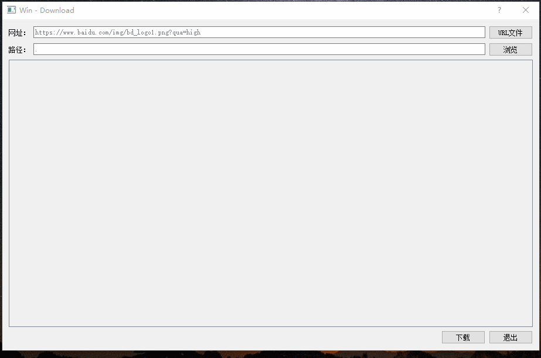

## 简介

&emsp;&emsp;一个简单的下载器，可以批量下载文件，保存到指定目录，类似浏览器的下载功能

## 演示



## 代码解释

&emsp;&emsp;这次的下载器代码比较核心代码比较简单，暂时只使用到了如下几个类

```c++
QNetworkReply
QNetworkRequest
QNetworkAccessManager
```

1. 使用`get`方法请求下载文件
   ```c++
   //调用该函数可以实现下载功能
   ReplyData DownloadManager::doDownload(const QUrl &url)
    {
        QNetworkRequest request(url);
        //QNetworkAccessManager使用get请求数据 
        QNetworkReply *reply = manager->get(request);
        //将返回的QNetworkReply和要下载的文件路径返回给ui类，方便进度条处理
        ReplyData date = {saveFileName(url), reply};
        return date;
    }
   ```
2. 检查下载进度

   ```c++
   //QMap<QNetworkReply*, QProgressBar*>  replyMap;
   //
	ReplyData replyData = manager.doDownload(url);
	QProgressBar* proBar = new QProgressBar;
	//设置进度条显示文字
	proBar->setFormat(replyData.fileName + "已下载%p%");
	//当下载数据更新时QNetworkReply会发出downloadProgress信号
	connect(replyData.reply, &QNetworkReply::downloadProgress,
			this, &Win::downloadProgress);
   ```
3. 保存数据

	```c++
	//将数据保存在本地
	//QNetworkAccessManager下载完毕后会发出finished信号，接收该信号，保存数据
	
	connect(manager, SIGNAL(finished(QNetworkReply*)),
			SLOT(downloadFinished(QNetworkReply*)));
	
    void DownloadManager::downloadFinished(QNetworkReply *reply)
    {
        QUrl url = reply->url();
        QString filename = saveFileName(url);
        qDebug()<<filename<<endl;
        if (saveToDisk(filename, reply))
        {
                qDebug()<<"保存成功"<<endl;
        }
        reply->deleteLater();//要使用deleteLater进行删除，否则有问题
    }
    
	bool DownloadManager::saveToDisk(const QString &filename, QIODevice *data)
    {
        QFile file(filename);
        if (!file.open(QIODevice::WriteOnly)) {
            return false;
        }
        file.write(data->readAll());
        file.close();
        return true;
    }
	```
  


## 注意事项

1. 在接收到`QNetworkAccessManager`的`finished`信号后，删除`QNetworkReply`对象时要使用`deleteLater()`方法
2. 要保证程序运行期间`QNetworkAccessManager`没有被析构，否则无法接收`finished`信号
3. 在线程中处理`QNetworkAccessManager`的`finished`信号时，要启用消息循环，否则无法接收`finished`信号
4. 在`Linux`下编辑文本，程序读出的换行符为` \n`,但在`windows`下程序读出的换行符为`\r\n`