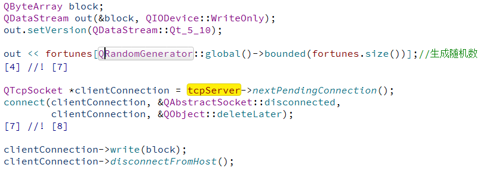

# FortuneServer
## 示例功能
&emsp;&emsp;创建一个tcp服务器，当有客户端连接时，向客户端发送下面列表中的一段文字。该示例可配合`BlockingFortuneClient`示例使用

```c++
QVector<QString> fortunes << tr("You've been leading a dog's life. Stay off the furniture.")
             << tr("You've got to think about tomorrow.")
             << tr("You will be surprised by a loud noise.")
             << tr("You will feel hungry again in another hour.")
             << tr("You might have mail.")
             << tr("You cannot kill time without injuring eternity.")
             << tr("Computers are not intelligent. They only think they are.");
```

## 代码解析
1. 程序执行前会根据当前网络配置，决定是否创建新的`network session`
  

  

2. 如果创建`network session`，将网络位置的`identifier`写入注册表，下次启动优先使用该网络配置.如果不创建，执行第三步。
  

3. 创建TCPServer，监听所有网络接口并自动选择端口
  

4. 当有新连接时想客户端发送一段文字
  


## 小知识点
1. QSettings 如果不设保存地址，而是使用 `Scope `中的枚举指定，则配置信息被保存到win注册表中，具体路径视枚举值确定

    ```c++
        enum Scope {
            UserScope,
            SystemScope
        };
    ```
    例如当枚举值为UserScope时，路径在`HKEY_CURRENT_USER\SOFTWARE`下

2. QLabel的成员函数`setTextInteractionFlags`可设置QLabel显示的文字是否可以被复制选中等

3. 获取本地所以ip地址

4. 创建一个0-10的随机数
```c++
QRandomGenerator::global()->bounded(10)
```

## 问题
1. 什么是  `network session`,什么时候需要使用到它